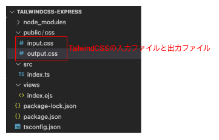
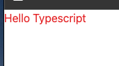

# Express で Tailwind CSS を使う方法(Typescript)

Tailwind CSS が便利だったので、Express での開発時でも使用したかったので、Tailwind CSS の導入方法を調べました。

Next.js を使用した場合は、プロジェクト作成時のウィザードで Tailwind CSS を使用する選択をすればいいだけだが、Next.js を使用しない場合は公式ドキュメントに従って手動で導入する必要があります。

# 完成品

作成したサンプルコードは[こちら](https://github.com/kuboshu83/study-tailwindcss-express)です。

# 構成

今回は基本的な Express での開発のため、以下のようなディレクトリ構成になっています。



# Tailwind CSS の導入

Tailwind CSS の導入は[ドキュメント](https://tailwindcss.com/docs/installation)の手順に従って実施します。

## モジュールのインストール

以下のコマンドで必要なモジュールをインストールします。

なお、Express など Tailwind CSS 関連以外のモジュールは必要に応じてインストールしてください。ここでは Express などのモジュールはインストール済みとして進めます。

```bash
npm install -D tailwindcss
```

## Tailwind CSS の設定

モジュールをインストールしたら以下のコマンドで Tailwind CSS を初期化します。

```bash
npx tailwindcss init --ts
```

上記のコマンドを実行すると、最小限の設定項目が記載された"tailwind.consfig.ts"が作成されるので、
自分のディレクトリ構成に従って内容を修正します。

今回の構成であれば以下のように修正します。
設定方法の詳細については[ドキュメント](https://tailwindcss.com/docs/configuration)を参照してください。

```typescript
import type { Config } from "tailwindcss";

export default {
  content: ["./views/**/*.{html,js,ejs}"],
  theme: {
    extend: {},
  },
  plugins: [],
} satisfies Config;
```

### content

content には、html などの Tailwind CSS のクラスが含まれているファイルへのパスを記載します。
今回は ejs を使用しますので、ejs ファイルへのパスを記載しました。

## CSS ファイルの準備

設定ファイルの準備ができたら次に css ファイルを用意します。
プロジェクトで使用している CSS ファイルの先頭に以下の記述を追加します。

今回は"css/input.css"に以下の三行を記述します。

```css
@tailwind base;
@tailwind components;
@tailwind utilities;
```

## Tailwind CSS のビルド

CSS ファイルが用意できたら、それをビルドして html ファイルから参照するための出力ファイルを生成します。

package.json の scripts に、以下の記述を追加します。

```json
  "scripts": {
	"style": "tailwindcss -i ./public/css/input.css -o ./public/css/output.css --watch"
  },
```

npm コマンドでこれをビルドすると、ビルドされたファイルが output.css として生成されます。

```bash
npm run style
```

--watch オプションをつけてるため、ejs ファイルが更新されるたびに自動でビルドが実行されます。

# EJS ファイルの作成

ビルドで生成された css ファイル(output.css)を ejs ファイルから参照できるようにすれば、
その ejs ファイルで Tailwind CSS が使用できるようになります。

```html
<!DOCTYPE html>
<html>
  <head>
    <meta charset="UTF-8" />
    <meta name="viewport" content="width=device-width, initial-scale=1.0" />
    <title>Tailwind CSS sample</title>
    <link rel="stylesheet" href="css/output.css" />
  </head>
  <body>
    <h1 class="text-red-600">Hello Typescript</h1>
  </body>
</html>
```

これを express でレンダリングすると、
図のように h1 タグの文字列に TailwindCSS で色が設定されたことがわかります。



# 参考

- [gitignore/nodejs](https://github.com/github/gitignore/blob/main/Node.gitignore)
- [Tailwind CSS(公式)](https://tailwindcss.com/)
